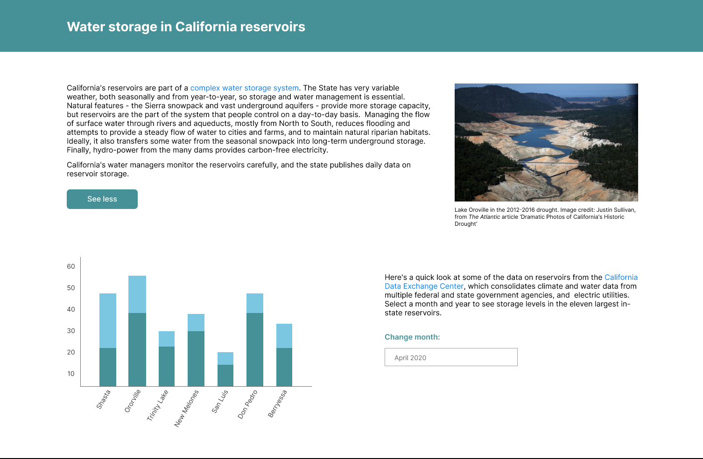

# California Water Levels

## Description
A website displaying information about the water levels in California's reservoirs. This project's front end uses React as well as a public data API to gather information on California's reservoirs water levels. Additionally my website includes two widgets: a chart and a month-picker. The API call to get reservoir data comes from the California Data Exchange Center, a government data service. I use two servers for my AJAX requests including the React server and a Node/Express server dedicated to handling AJAX requests.
